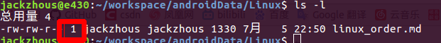
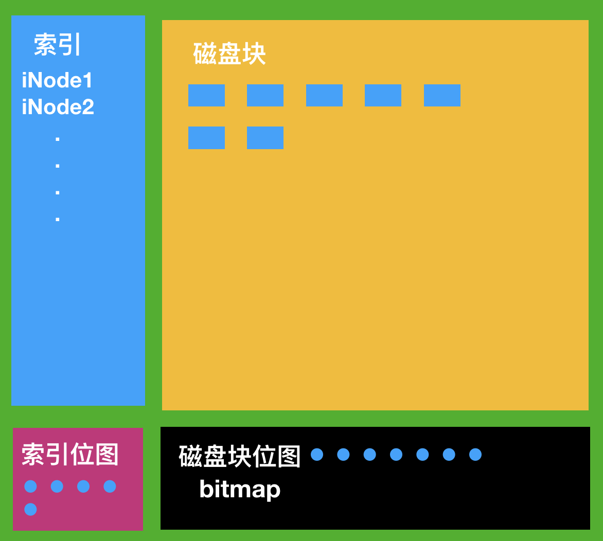
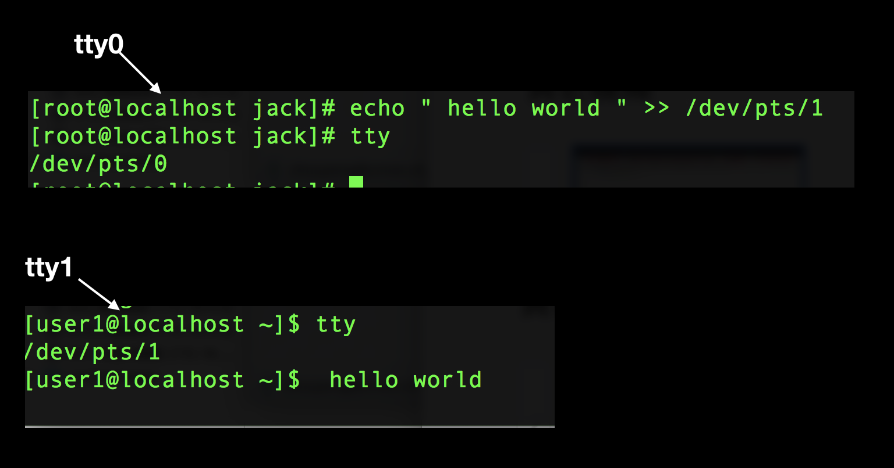

# Linux硬盘
	硬盘一般挂着在/dev/下面，sd表示是SCSI硬盘，sdx,其中x=a表示第一块硬盘，b表示第二块，依次类推
## 磁盘格式
	将磁盘分区，Linux下面一般有两种格式：

+ MBR
+ GPT

__为什么要分区？__

+ 隔离系统和程序
+ 可以安装多个os
+ 优化IO性能

### MBR格式

	MBR最多有4个主分区，命令为sda1、sda2等，可以是4个主分区或者3个主分区和1个扩展分区；第一个逻辑分区必须从5开始，也就是sda5,并且每个分区大小不超过2T;

### GPT格式

	支持128个分区，使用64位，可以划分道8Z、64Z

```
查看 识别新的分区 ：cat /proc/partations:
```

## 文件系统
	
	文件系统是对数据在磁盘上存储的管理，用于指导数据输入、输出、修改、存储等

```
cat /proc/filesystems  //查看系统支持的文件系统格式
```


__分区命令：__
	fdisk -l /dev/sdX 查看分区信息，其他功能参考命令帮助
	fsck 检查修复磁盘

---
## 磁盘看
	df 整个磁盘情况
	du 路径情况

# Linux 原则

	程序功能单一化
	一切皆文件
	尽量不与用户交互，自动完成

## Linux GUI图形界面

+ Gnome c语言编写
+ KDE c++编写
+ Xface
	windows的桌面系统都是封装在内核里面，而Linux则不是，所以可以自定义

## Linux 命令终端

+ bash
+ csh
+ zsh等等

---

## 文件格式 ls 

+ - 普通文件
+ d directory
+ c charctor device file
+ b block块设备文件
+ l 链接文件
+ p pipe file
+ s socket file


红框表示文件的硬链接次数

## 环境变量

```
	printenv //打印环境变量
```

## PATH
	当我们敲入命令时会从PATH这个环境变量去找，PATH后面的值用冒号分开;如果每次都敲命令都会去PATH里面去找拿起不是很麻烦，每次都找？ 
	答案不是的，每次从PATH命中命令后都会缓存到hash里面（敲hash你就知道），hash是用键值对存放，所以敲命令先会去hash里面找，hash是用hash存放命令，取出命令很快，比PATH快多啦
## tree和pstree
	文件树和进程树

## type 显示命令是哪种类型

## 命令帮助格式

+ [] 可选的，可省略
+ | 多选一，不可能同时选择
+ <> 必须选的  不可忽略

## ssh登录

	1. 首先保证网络可ping通
	2. 其次ssh 用户名@IP即可登录
---

## 根目录详解

	bin: 二进制文件
	sbin: 管理命令
	lib: 库文件和一些内核模块 lib/moudles
	proc: 伪文件夹，系统运行起来后。对系统进程的映射
	sys: 系统运行起来后，对内核外的映射
	opt: 可选文件夹，安装第三方软件的目录（现在不建议安装此处）
	dev: 设备描述文件，不能直接读取，只能挂载到文件系统下去读取
	mnt/media: 挂载第三方文件系统
	usr: universal shared read-only,全局制度共享文件，里面的usr/local现在建议安装第三方文件
	tmp: 临时文件
	etc: 配置文件，配置文件微源文件

---

## 文件操作命令

### cut命令
	截取命令,将一个文本文件或者字符流截取其中的文本
	cut -d 'sep' -f 1 (file or stream) 将file或者stream以sep分割，输出第一个到最后一个

### 追加
	echo "mmm" >> file 向file文件末尾追加mmm
	echo "mmm" > file 清空file，将mmm覆盖到file文件里面去


### sed命令,流编辑器 string editor
	行编辑器，不修改源文件；按行读入内存模式空间，符合条件的显示道界面
	sed [option] 'AddressCommand' file ...
	-n 静默显示  不显示模式空间中的行
	-i 直接修改源文件
### Address位置确定
	1. startLine,EndLine 例如1，200行
	2. /正则表达式/ 例如 /^root/开头的行
	3. /pattern1/,/pattern2/以patter1开始patter2结尾的行
	4. listNumber 指定的行
	5. startLine, +N 指定行以及后面N行

### Command操作指令
	对上诉符合的行进行操作
	d 删除行
	p 显示行
	a \string 追加字符
	i \string 头追加字符
	r FILE 将File的内容读取到符合行后面
	w FILE 将符合的行写到FIle里面去
	s/pattern/string/修饰符  默认将每行中第一个符合patter替换为string
		修饰符：
			g 全局替换
			i 忽略大小写
	例子：
		sed "/root/d" /etc/passwd 删除文件中包含root的行
		sed "s/l(..k)/L\1/" /etc/passwd 将l..k替换为L..k


### sort命令
__对文件内容进行排序，不改变源文件，默认是比较第一个字符，相等在比较第二个字符这样比较出大小进行排序__
	-n 表示以数值大小排序
	-f 忽略大小写
	-r 反向输出比较结果
	-k 以某一个关键字key的位置开始比较
	-t 以某一个字符为分隔符分割后比较常与-k配合使用
	sort -t':' -k 3 file  以:为分隔符，第三处的单词开始比较
	-o 将比较结果输出到一个文件

### uniq
__只有相邻的重复行才算重复__
	-u 只打印不重复行
	-d 打印重复行，重复行只打印一个
	-D 打印重复的行，把重复的所有行都打印

### wc (word count) 文本统计命令
	-w 打印某一个单词出现次数
	-l 打印文件行数
	-L 打印长度最长的行号

### tr 转换或删除
	将stream或者文件中字符转换或者删除，不改变源文件
	tr 12 34 < file 将file中出现1的地方换成3, 2的地方换成4

## sh及其特性
	sh是用户离内涵最近的操作
GUI: gnome、xface、KDE
GLI: sh、ash、csh和bash,bash是功能最强大而且开源

### bash特性
	1. 历史命令
	2. 可以编程
	3. 命令行通配
	4. 文件名通配

ctr+e 跳到行尾  ctr+a跳到行首

### alias 命令别名
	作用范围在当前sh进程,不加参数打印所有的别名定义
	alias COMMAND='COMMAND [option] [args]'
	例如： alias cls=clear
_unalias撤销别名__

### 命令替换
	将命令执行的结果替换
	touch "file_$(date +%F-%H-%M).txt"  创建以日期为基础的txt文件

### 文件通配符
	搜索和查找文件时，使用通配符事半功倍
	*     任意个任意字符
	?X    1个字符X，两个问号就是两个
	[a-z] a到z范围的一个字符
	[^[]] 不包含某一特性之外的结果  

---

## IO重定向
	IO可以理解为输入输出通道，输出流
	> 输出重定向，直接覆盖
	>> 追加方式输出重定向
	2> 错误信息重定向
	&> 正确和错误信息重定向
	< 输入重定向
	<< Here Docment,此处是到文件结束府标记

## 管道
	不是重定向，是前一个命令执行结果当作后一个命令的输入
	管道通常有一个 ‘|’ 分隔符
	例如：
		cut -d: -f1 /etc/passwd | sort

## tee
	同时输入输出到桌面和文件

## "" 双引号和``单冒号
	“” 表示内部纯粹字符串
	`` 不是单引号，命令替换，执行结果作为另一个命令的输入

## chown 修改属主
	chown user file
	-R 递归指定
	-reference=FILE file  改file的属主、组和FILE一样
	user:group  属主和属组同时修改

## chgrp 修改属组
	chogrp group file

## chmod 修改权限
	u= 属主权限
	g= 属组权限
	o= 其他用户权限
	例如： chmod u=rx file

## umask 遮罩码
	用户创建文件时默认权限 = 777 - umask
		目录时权限     = 666 - umask	

## grep -- global research
	全局搜索，可以以字符和正则表达式搜索，但是正则表达式有点不同
	-E 使用扩展表达式(egrep就是这个命令)
	-A 2 搜索到时同时显示改行的后两行
	-B 2 前2行
	-C 2 前后2行
	-o 只显示查找到的字符串，不显示行

### 基本表达式
	*出现它之前的字符出现任意次数，如 a*b 表示a出现任意次数并后面跟一个b
	. 表示一个任意字符
	\? 表示它前面的字符出现0次或者1次
	+至少出现一次
	^ 它后面的字符作为必须是行首
	$ 它前面的字符必须是行尾
	\< \>精确查找，以\<开头  \>结尾的字符
	\{m,n\}  它前面的字符出现m,n之间
	\(\) 分组符号，括号括起来的作为单词
	上一个后面跟 \1 \2表示分组后面还要出现一次，例子 "\(hello\).*\1" 表示hello后面还要出现一次

### 扩展表达式
	{m,n } 同上，但是可以不用反斜杠
	() 同上
	\1 \2意义相同，要反斜杠
	| 或者 a|b a或者b a|bc a或者bc

## 正则表达式
	* 任意字符
	. 任意多个
	[] 范围限定，例如 [0-9] 字符必须是0-9范围
	[^] 范围之外，和上面相反
---

## 变量
	$a a表示一个变量
	变量与其他字符在一块时为了区分，像这样使用
	${a}b

## 条件语句
	if 条件; then
	elif 条件; then
	fi

	if 条件; then
	else
	fi

## 条件case
	case 变量 in
	value)
		....
		;;
	*)
		....
		;;

## 整数测试
	-gt
	-ge
	-lt
	-le
	-ne
	-eq
	以上的操作符需要[]

## 文件测试
	-e 文件名/路径  文件是否存在
	-f 是否为普通文件
	-d 是否为目录
	-r 当前用户是否有读权限，其他w/x类似
	需要[]

## 字符串测试
	== 字符串等于，相等为真
	!= 不等为真
	> <大于和小于
	-n 字符串是否为空，空为真，不空为假
	-s 字符串不空为真，空为假

## 算数运算
	shell中都把识别为字符，如果要进行算数运算，以下：
	expr `$a + $b`

## 循环
	for 变量 in 列表; do
	done

## sep 生成列表
	sep 1 2 100 生成1，100的列表，步长2

## declare 声明类型
	shell默认变量都是字符型的
	-i 声明整形
	-x 环境变量

## vim编辑器
	命令行模式 ! command 可以shell交互

## 文件查找

### locate 文件名关键字，模糊查找并且不是实时的
	_locate命令不存在的要下载mlocate模块并且updatedb手动刷新数据库_
### find命令  精确查找
	-i 忽略大小写
	-name 文件名
	-user 属主
	-nouser 没有属主的文件
	-type 文件类型查找 d 目录
	__组合条件：__
		-a 和
		-not 非
		-o 或
	例子：find ./ -not \(-user user1 -o -user user2\)  查找当前目录下既不是user1也不是user2的目录
	__时间条件：__
		-ctime	创建的天数
		-atime	访问的天数
		-mtime 	修改的天数
		例如：
			-mtime +5 表示过去5天的前面时间 -5 表示当前到过去5天的时间 5表示过去的底5天
		-cmin -amin -mmin同上
	__权限匹配：__
		-perm 权限匹配
		-perm 644 精确匹配
		-perm /644 模糊匹，有一位权限匹配上也通过
		-perm -644 每一位都匹配，和精确匹配更精确，包含关系

## stat
	stat file/directory 查看文件或者路径状态

## SUID权限
	用户执行去访问某权限，该文件有SUID权限，如果执行者不是该用户，则该文件默认是以文件的user来运行，SGID同理
	chmod u+s FILE 赋予FILESUID权限,改变后文件有s权限
	chmod u-s FILE 	减去S权限

## FACL FileSystem Access Control List
	文件的额外控制列表,利用文件的额外属性，对文件进行操作	
	setfacl: 设定文件访问控制列表
		-m 设定
			u:user:rwx file  修改该文件的特定用户的特定权限
			g:group:rwx file
		-x 取消
			u:user 取消访问控制列表的用户

	getfacl: 获取文件访问控制列表

## 睡眠
	sleep 睡眠几秒钟

## last
	显示用户的登录历史,显示/var/log/wtmp文件的内容
	-n 显示最后几次
## lastb
	显示用户的错误登录历史,显示/var/log/btmp文件的内容
	-n 显示最后几次
## lastlog
	显示系统上所有用户的最近一次登录历史
	-u 特定用户

## basename
	取一个路径的基本名字，也就是路径的最后一级名，常用语脚本
	path

## mail 
	当前系统每个用户都有邮件，只能各个用户互相发送

## hostname 显示主机名

## RANDOM
	shell内置的一个环境变量，0~32768之间的随机数
	随机数默认保存在系统的一个商池，会存在取完的情况
	/dev/random
	/dev/urandom 

## 磁盘管理


### 硬件简介
	由一张张圆盘碟在一起，圆心轴带动圆盘转动，机械臂接近盘面，利用电磁效应读取和写入数据；每一张圆盘正反两面均可读写数据，机械臂的读取点十分接近盘面，距离只有几个微米，所以磁盘一般是设计在真空中使用，拆开后再合上磁盘，磁盘很大几率会坏掉；由于磁盘是利用自旋转和机械臂移动读取数据，所以在日常操作磁盘的时候尽量不要抖动磁盘
	__注意：__机械臂是每张盘面的正反面都有一个机械臂

### 特性及组成

#### 名词解释
	__磁道__：圆盘上的区域可以划分成一个个同心圆
	__扇区__：一个角度延伸出去的扇形区域，每个扇区要存储自己的ID号、扇道号
	__柱面__：不同盘面的相同圆环组成一个圆柱体,即相同编号的磁道
	__读取率__：机械臂移动到磁盘上的任意位置进行速度读取，这个时间的长短决定了磁盘的读取效率
	
#### 特性
+ 外环扇道存储的数据多余内环，而且速度也快于内环
+ 利用上述外环扇道应该存储读取频繁的数据文件，内环则存取读取不频繁的数据
+ 同一柱面上的数据读取是最快的，所以分区一般是以柱面分区

### 磁盘出厂
#### 低级格式化
	根据磁盘的旋转速度等特性划分好磁道、扇区

## 分区（用户自行分区）
	分区用于安装多个文件系统
#### MBR - Master Boot Record 512byte
	此数据存放在0磁道0扇区，不属于任何操作系统，必须有它才能启动操作系统
	446byte：存放BootLoader程序，用于加载内核的
	64byte:  每16个字节标识一个分区，所以MBR最多只能有4个分区，可以用一个分区存放指针，指向其他一个区域，叫做扩展分区
	2byte：	 魔数，标识MBR是否可用

### 磁盘读取文件逻辑 即文件系统ext2
	文件系统本身是一个软件，他存放在磁盘上，但是不是在分区上,管理分区上的文件

#### 名词解释
	__磁盘块：__为了便于管理，将磁盘上的扇区分为一个个磁盘块
	__磁盘块位图：__每个磁盘快占一位位图，用次位图标识磁盘块是否被占用，写入数据时直接扫描块位图，快速找到磁盘快写入
	__inode号：__每个文件或目录对应一个inode号，iNode号全局唯一，iNode号包含：文件或目录属组等、磁盘块位置、文件副属性等，但是不暴击文件名和目录
	__索引：__索引存放了所有的iNode号，通过在索引中搜索到iNode号并找到存放文件的块磁盘
	__索引图：__磁盘现如今很大了，索引也会变得很大，当写入一个索引时要先从索引中去找空的位置很耗时的，所以做了一个和磁盘块位图类似的索引图，快速找到空的索引以写入
	
	磁盘内部逻辑划分如下：	


__查找文件例子：__
	查找/var/log/message文件
	1. 内核启动后，会自索引根目录，在索引表中，根据根目录的iNode号查找到对应的磁盘块
	2. 在磁盘块中，大致存放着两列数据，iNode号序列与其对应的根目录下的路径名和文件名，此时查找到var路径及其对应iNode号
	3. 回到索引根据var的iNode号查找到var对应的磁盘块
	4. 在磁盘块中，与第2条类似，根据log路径名查找，与之对应的iNode号
	5. 对应第3条根据iNode号查找到log的磁盘块，在磁盘块中根据文件名message查找到iNode号
	6. 回到索引表，根据iNode号查找到message的磁盘块，这样就找到message文件了

__创建文件例子：__
	创建/dev/message，基于/dev路径存在的前提下
	1. 先扫描索引图，查找空索引，为其分配一个iNode号，占用此位
	2. 扫描空的位图，拿到空的磁盘块，写入message的文件,并把占用的磁盘快号写入到iNode信息里面去
	3. 在把iNode号和文件名写到dev对应的磁盘快

__删除件例子：__
	删除/dev/message
	1. 找到Message后，清楚掉索引图对应的这个iNode号的索引位置，置为可用
	2. 并把iNode对应磁盘块的位图置为可用即可，没有去修改磁盘块上的位置

## 链接文件
	硬链接：两个链接文件都指向同一个iNode
	ls -l显示的结果第二列数字表示硬链接的次数,所以一般删除文件要这个硬链接次数小于1时才删除文件·
	不能使用路径
	不能跨文件
	软链接：文件指向的是另一个文件的路径

## 特殊文件
	如b c等类型的特殊文件，此类文件在磁盘上只有iNode号没有磁盘块，所以不占用内存,这类文件通常用作硬件方面的，比如插入一个硬件，自动对应到这个特殊文件，此时往这个特殊文件写入或者读取就是从这个硬件上操作的，例如：
	tty 命令,显示当前终端操作的特殊文件



	创建特殊文件：
	mknod

## 创建文件系统(高级格式化)
	mkfs、mke2fs、mkfs.ext2等等
	mkfs -t ext3 /dev/sdax 在sdax分区上穿件ext3文件类型系统
	上面类型等于 mkfs.ext3 /dev/sdax
	/proc/filesystems 查看当前系统支持的文件系统
	/lib/modules/3.10.0-862.el7.x86_64/kernel/fs/

	__bkid__ 查看分区文件系统类型
	__tune2fs__在已经创建文件系统的分区上改变部分属性
	__dumpe2fs__查看分区块信息
	__fsck__检查并修复Linux文件系统
	__e2fsck__专门修复ext2 ext3上的文件系统

## 挂载 -- 将创建的新文件系统关联到根目录
	没挂载一个设备都会讲挂载记录写入/etc/mtab
	mount [option] [-o option] 挂载设备  挂载点
		设备：
			设备文件
			卷标 LABEL=""
			UUID UUID=""
		挂载点：
			目录（目录存在并且没有被其他进程使用，如果目录非空其内部文件将会被掩藏）
	umount 挂载点
		1. 卸载时没有进程使用

## RAID
	将多块不同的硬盘挂在同一个控制芯片下，由该芯片统一管理，数据通过芯片在分别写入其下的硬盘，提高数据读写效率；提高效率的同时还要注意数据安全问题，备份、防丢失等各种，现在又两种RAID，硬件RAID和软件模拟RAID
	RAID根据不同的数据存储方式分别为RAID0~RAID6，级别为，0这种技术损坏一块盘会导致数据无法恢复， 1-是mirror，1对1备份，损坏一块不受影响  其他不了解
	以下mdadm是管理RAID的一种工具

### mdadm 命令实现上述功能
	将任何块设备做成RAID
+ 创建模式
	-C
		-l : RAID级别技术
		-n /dev/sdx : 由几块设备组成
+ 管理模式
	--add, --del
	-f 设置某块盘损坏
	-r 移除掉一块盘
+ 监控模式
	-F
+ 增长模式
	-G
+ 装配模式
	-A 
+ 查看
	-D /dev/mdx 查看详细信息
	-S /dev/mdx 停止阵列

## 保存mdadm配置信息
	mdadm配置好后，可以使用以下命令保存配置信息到/etc/mdadm.conf，下次直接启动，如下
	mdadm -D --scan > /etc/mdadm.conf
	mdadm -S /dev/mdx   	//停止md设备
	下次启动
	mdadm -A /dev/mdx

## LVM
	LVM是一种数据存储模型，可以动态调节存储单元的大小，它由pv、vg、lv组成
	vg-virtual group  pv lv
	pe
	pvcreate /dev/sdx 创建pv设备
	pvs/pvdisplay 显示创建的pv设备
	vgcreate name 创建vg
	vgs/vgdiplay 显示
	lvcreat -n lvname vg -L size
	lvs

	当pv空间有多的想移走，则先要pvmove掉当前pv上的数据，在vgreduce vgname /dev/sdbx移除掉某个pv
	当vg磁盘不够了，想添加一块pv，则先pvcreate一块pv,在vgextend vgname pv即可
### 扩展LVM逻辑卷
	不能超过物理边界
	lvextend
		-L [+]#  /path/to/lv ; +3G 扩展3G逻辑卷
	resize2fs
		-p /path/to/lv	; 同步大小到lv上去
	df -h 查看逻辑卷已经扩展了
### 缩减LVM逻辑卷
__注意：__
1. 不能在线缩减,先卸载
2. 必须强制检查文件系统
3. 保证缩减后的卷大小能够存放已有的数据

	umount
	e2fsck -f lv
	开始缩减
	resize2fs lv size ; /dev/myvg/mglv 300M 缩减到300M
	lvreduce -L 300 lv
	df -h		查看状态

### 快照卷
1. 生命周期为整个数据时长，在这段时间内，数据的增量不能超过快照卷大小
2. 快照卷应该是只读的
3. 跟原卷属于同一个卷内

lvcreate
	-s 标明是快照卷
	-p r|w 权限
lvcreate -L # -n 卷名 -s -p r lv

## 网络问题
	联网必须满足以下几个配置：
	IP、netmask、gateway、hostname、dns、路由

### ifconfig
	ethX IP/MASK  // eth0 10.1.1.1/8 配置IP
	ethX up或者down  //启用、停用网卡,立即生效，重启失效

### 网络服务
	/etc/init.d/network (start|stop|restart|status)

### 网关路由
	route:
		add 添加
			-host 主机路由
			-net  网络路由
	route add -net 10.0.0.0/8 gw 192.2.2.1
		del 删除
			-host 
			-net 和上面一样  gw及其以后可以省略
		-n 以数字显示
	__改动网络重启主机会失效__

### 网络接口配置文件
	/etc/sysconfig/network-scripts/ifcfg-INTERFACE_NAME
	配置后不会立即生效，重启生效
	文件内容解释：
		DEVICE=; 设备名称需要和文件名称后部分一致
		BOOTPROTO=[static|none|dhcp|bootp]; 引导协议,静态使用可以取值static或none；dhcp动态获取DHCP服务器地址
		IPADDR=; ip地址
		NETMASK=; 子网掩码
		GATEWAY=；网关地址
		ONBOOT=;  开机时是否自动激活此接口
		HWADDR=;  硬件地址，必须和硬件地址一致，可以省略
		USERCTL=[yes|no] 是否允许普通用户使用该接口
		PEERDNS=[yes|no] 是否在BOOTPROTO为DHCP时接收由DHCP服务器提供的DNS地址
		MM_CONTROLLED=[yes|no] 修改后立即生效，无须重启网卡
	__路由配置文件__
	route-ethX
	文件内容格式
	DEST via NEXTHOP

### DNS 服务器指定
	/etc/resolv.conf
	namerserver DNS_IP //如果上面ifcfg-文件的BOOTPROTO为dhcp，他会修改这个文件，如果不想修改，则写PEERDNS为no即可

## 动态链接和静态练剑
	静态：库会和源文件打包在一个文件
	动态：库不会和源文件一起打包

/boot : 内核

## rpm命令

### rpm包结构
	主包：
		bind-9.7.1-1.e15.i386.rpm
	字包：
		bind-libs-同上
	结构：
		name-version-release.arch.rpm
		bind-major.relaease-release.arch.rpm
	主版本号：重大功能改变
	此版本号：某个子功能发生改变
	发型号：修改bug
### rpm格式
	二进制：直接安装

### 安装
	rpm -i rpm包  安装
	    -v 详细信息
	    -h 以#表示白分包进度
	    --nodeps 忽略依赖关系，安装有可能无法使用
	    --replacepkgs: 重新安装，替换
	    --oldpackgs: 降级安装
	    --force: 包含以上两个，强行安装
	    --test: 检查依赖关系，不安装
### 查询
	rpm -q PACK_NAME
	    -qa 所有安装
	    -qi PACK_NAME 查询包的说明信息
	    -ql PACK_NAME 查询包安装后的文件
	    -qf file 查询该文件由哪个rpm安装包安装的
	    -qd PACK_NAME 指定包的帮助文档
### 升级
	rpm -Uvh .rpm 如果已安装，则升级；否则就安装
	rpm -Fvh .rpm 如果已安装，则升级，否则退出

### 卸载
	rpm -e PACK_NAME

### 源程序编译安装步骤
	1. ./configure
		--help=帮助文件存放位置
		--prefix=安装文件路径
	2. make命令编译原成员
	3. make install 安装

## Linux进程管理
	
### 内核空间和用户空间
	内核空间执行一些重要的操作，比如硬件操作、进程管理，内和空间的根据Linux的执行权限应该是圈0
	用户空间是执行用户的一些普通操作，执行权限是圈3
	上述空间都在内存当中，内存被一分为2

#### 内核空间
	进程的任务结构队列：
		存放每个进程用户名、ID、父进程ID、执行到该进程的哪个位置等等，具体的进程执行代码存放在用户空间
	
	调度优先级（0~139）：
	数字越小，优先级越大； 0~99内核调整  100~139用户调整
	每个进程有一个nice值，范围是-20~19，对应100~139，调整进程的nice值可以修改优先级,普通用户只能调大

### 进程管理命令

#### ps -- process status
	a: 显示所有与终端有关的进程（终端启动的进程）
	u: 显示进程的执行者用户
	x: 与a相反
	上述命令执行后的结果有一个[STAT]的字段，解释：
		D: 不可中断的睡眠
		R: 运行或者就绪
		S: 可中断的睡眠
		T：停止
		Z：僵死
		<: 高优先级进程
		>: 低优先级进程
		+：前台进程组的进程
		s: 会话进程
		l: 多线程进程
	[COMMAND]字段：
		表示该进程发起的执行命令，如果是用[]中括号表示是内核进程
	-e 默认短格式风格，显示所有进程
	-l 长格式
	-o pid, command等等  指定显示字段

#### pgrep 
	等同于ps grep，默认结果只显示进程号
	-u userid 用户进程id

#### pidof 根据名字查看进程id号

#### top命令 动态显示进程信息
	如下例子：
	top - 02:44:52 up  3:30,  1 user,  load average: 0.00, 0.01, 0.05
	Tasks:  90 total,   2 running,  88 sleeping,   0 stopped,   0 zombie
	%Cpu(s):  0.0 us,  0.3 sy,  0.0 ni, 99.7 id,  0.0 wa,  0.0 hi,  0.0 si,  0.0 st
	KiB Mem :   757460 total,   523936 free,   101200 used,   132324 buff/cache
	KiB Swap:   839676 total,   839676 free,        0 used.   517420 avail Mem
	依次内容是：
		第一行：当前时间、开机至此运行时间、用户数、内核进程队列在1分钟、5分钟、15 分钟的队列平均长度
		第三行：用户空间占比、内核空间占比、调整nice值影响比例、空闲操作、等待操作、硬件中断、软件中断、被偷走的时间
	PID USER      PR  NI    VIRT    RES    SHR S %CPU %MEM     TIME+ COMMAND   
	SHR 共享库大小 S是状态
	__top是交互式命令：__
		M：根据内存大小排序
		P: 根据CPU排序
		T: 累计时间排序
		l: 是否显示平均负载和时间
		t: 是否显示进程和CPU时间
		m: 是否显示内存信息
		c: 是否显示完整命令行
		q: 退出top
		k：杀死某个进程
	-d 每个多少时间刷新

## 进程间通信
	共享内存、信号signal等

### kill
	通过信号机制发送信号
	-l 显示可以发送的信号，以下是重要的几个信号：
	1:SIGHUP 不用重启进程就可以重读配置信息
	2:SIGINT 中止进程的中断信息
	9:SIGKILL 杀死信号，立即杀死
	15:SIGTERM 终止信号，会给进程一段时间，处理后再杀死

	killall command 杀死进程名为command的命令，也可以加入信号

### renice值调整
	renice nic值 pid
	启动时指定：
	nice -n nic值 command

## 前后台进程切换
	ctr+z 已经存在前台的进程切换到后台运行
	fg  jobsid  恢复后台进程到前台
	command & 启动进程并把他放到后台去

## 命令
	bg: 让后台停止的作业进行工作
		bg JOBID
	jobs： 查看后台所有的进程
		作业号不等于进程号
		+ 第一默认的作业
		- 第二默认的作业
	vmstat 显示

## 启动服务的级别不同
	运行级别： 0~6
	0 halt
	1 single user mode,直接管理员登录，不需要密码
	2 multi user mode 多用户模式，no NTFS，宕机的时候可以以此登录进行修复
	3 mult user mode, text mode  正常多用户模式
	4 reserved 保留
	/etc/inittab下面配置
	5 multi user mode, graphic mode  图形界面模式
	6 reboot

__查看运行级别__
	runlevel 
	who -r

__查看内核版本号__
	uname -r

## Linux启动流程

	POST --> BIOS(boot sequence) --> MBR(bootloader, 446) --> Kernel --> initrd --> (ROOTFS)/sbin/init(/etc/inittab)

### 详细启动流程
	bootloader(MBR)
		LILO: LInux LOder
		GRUB: GRand Unfied Bootloader
			stage1: MBR
			stage1_$:
			stage2: /boot/grub

### 修复grub
	grub 进入grub命令行

### 进入单用户模式
	grub方法，在启动选择界面进入编辑模式后，在Linux内核指令处最后加1即可
	grub2则需要在后面加入 init=/bin/bash
